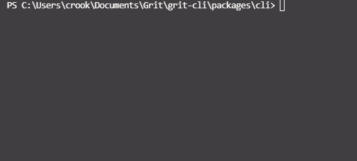

<p align="center">

<p align="center">
&nbsp;
<a href="https://badge.fury.io/js/grit-cli"></a>
&nbsp;
<a href="https://www.npmjs.com/package/grit-cli" target="_blank">

</a>
&nbsp;

&nbsp;
<a href="https://github.com/TimCrooker/Grit/actions/workflows/test.yml">

</a>
&nbsp;

</h1>

## Overview

Grit is a scaffolding tool built to speed up a developers workflow through the use of reusable code generators. Grit generators are run in the command line with the Grit CLI where they gather information from users to scaffold out new files, library configs, or really anything code related. Generators have access to a libray of useful methods that allow them to perform nearly any task, so there is no limit to what Grit can do

## Installation

Install the Grit CLI globally on your machine

```bash
npm install -g grit-cli
```

## Home screen

Run the `grit` command in your terminal to open the grit home screen

```bash
grit
```

You should be greeted with the following display


From here you can explore Grit and begin to play around with generators

## [Run a generator](https://timcrooker.github.io/Grit/docs/usage/run)

Run a generator to scaffold out new projects or inject code into existing projects.

```bash
grit run <generator> [outDir]
```

Example:

This example uses [grit-react](https://github.com/TimCrooker/grit-react) to build a new React project into the `my-grit-generator` directory

```bash
grit run react my-grit-generator
```

## [Install generators](https://timcrooker.github.io/Grit/docs/usage/install)

Install a generator on your local machine for later use online or offline.

```bash
grit install <generator>
```

Example:

This example will install [grit-react](https://github.com/TimCrooker/grit-react) on your machine

```bash
grit install react
```

## [Update generators](https://timcrooker.github.io/Grit/docs/usage/update)

Update your installed generators and keep up with the newest features.

### Update a generator

```bash
grit update <generator>
```

Example:

This example will update [grit-react](https://github.com/TimCrooker/grit-react) to the newest version

```bash
grit update react
```

### Show a list of generators with updates

```bash
grit update
```

Shows the following screen where you can select generators to update them


## [Remove generators](https://timcrooker.github.io/Grit/docs/usage/remove)

Remove your installed generators to fix unexpected issues or to clean up your generator list.

### Remove a generator

```bash
grit remove <generator>
```

Example:

This example will remove [grit-react](https://github.com/TimCrooker/grit-react) from your machine

```bash
grit remove react
```

### Show a list of generators to remove

```bash
grit remove
```

Shows the following screen where you can select generators to remove them


## [Discover new generators](https://timcrooker.github.io/Grit/docs/usage/find)

Discover new generators from the community that you can install and run.

### List community generators

This command will list all generators availiable from npm ranked in order of popularity

```bash
grit find
```



### Search for generators

Example:

This example will search npm for any generators related to react

```bash
grit find react
```


## Documentation

The best way to explore all the features of **Grit** is to read the project [Documentation](https://timcrooker.github.io/Grit/)

## Project assistance

If you want to help out and/or support development of `Grit`:

- Add a [GitHub Star](https://github.com/TimCrooker/Grit) to the project.
- Publish [your own generators](https://timcrooker.github.io/Grit/docs/create-generator/overview) for the community to use
- Submit a pull request on [GitHub](https://github.com/TimCrooker/Grit/pulls)
- Write interesting articles about project on [Dev.to](https://dev.to/), [Medium](https://medium.com/) or personal blog.

[awesome-grit](https://github.com/TimCrooker/awesome-grit)

## License

`Grit` is free and open-source MIT licensed software.
